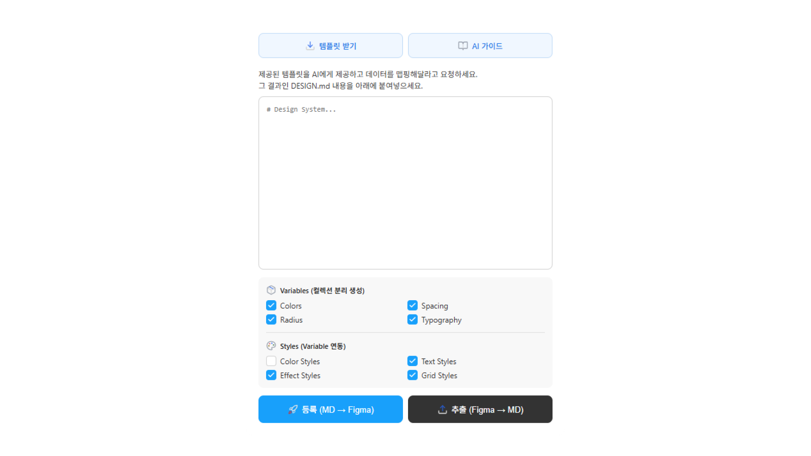
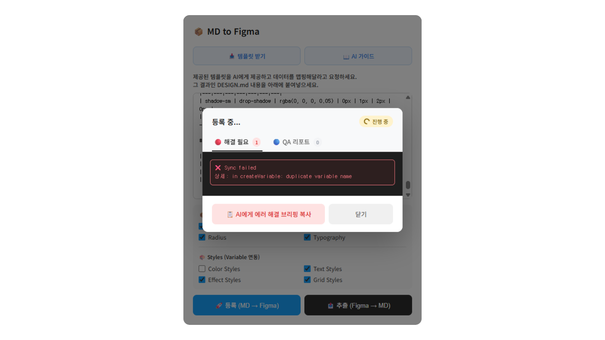
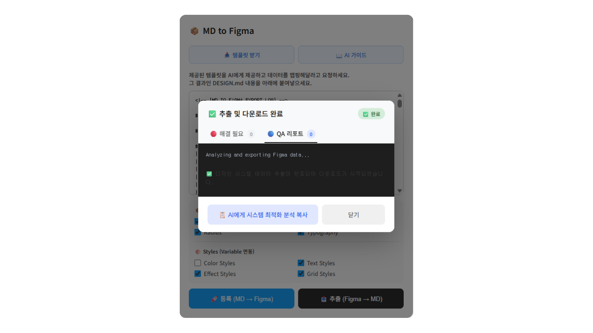
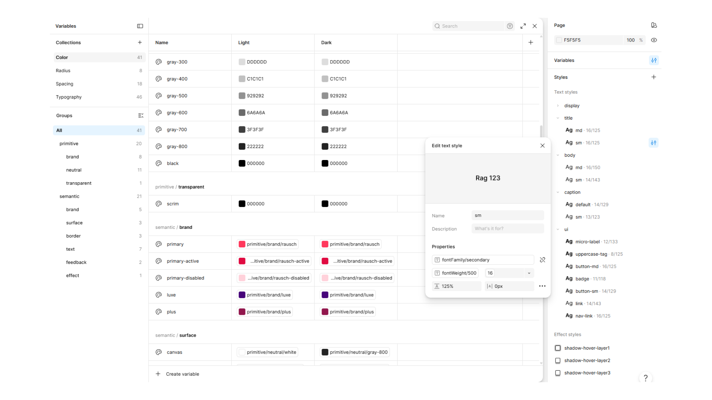

# 📦 MD to Figma

**The Complete Bidirectional Design System Engine — Variables, Styles, and Data Extraction at Once!!**

Figma plugin that synchronizes your entire design system between Markdown and Figma. 
Create Variables & Styles from MD, or export your existing Figma system back to MD — with smart bindings and zero configuration.

[](https://www.figma.com/community/plugin/YOUR_PLUGIN_ID)


---

## 💡 MD to Figma를 쓰는 이유 (v2.0.0 Major Update)

1. **AI 워크플로우 최적화**: AI가 생성한 `DESIGN.md`를 피그마에 즉시 무료로 이식합니다. MCP의 토큰 낭비 없이 대규모 시스템을 구축하세요.
2. **양방향 동기화 (Bidirectional)**: 피그마에 구축된 복잡한 변수와 스타일을 다시 마크다운 문서로 정밀하게 추출(Export)할 수 있습니다.
3. **시멘틱 디자인 보존**: 폰트가 시스템에 없더라도 사용자의 원래 '디자인 의도'는 배리어블에 영구 보존하고, 화면은 안전한 폴백 폰트로 렌더링합니다.

```
AI / Documentation  ⇄  DESIGN.md  ⇄  MD to Figma  ⇄  Figma Variables & Styles
                                   (양방향, 자동화)
```

---

## ✨ Key Features (v2.0.0)

### 🔄 1. The Bidirectional Engine
- **MD → Figma (Generate)**: 마크다운 테이블을 분석하여 변수(Variables)와 스타일(Styles)을 완벽한 계층 구조로 자동 생성합니다.
- **Figma → MD (Export)**: 피그마의 기존 변수와 스타일을 다시 깨끗한 마크다운 문서로 추출합니다. 참조가 끊긴 데이터는 `recovered/` 토큰으로 지능적으로 자동 복구합니다.

### 🏛️ 2. Semantic Typography Architecture
- **의도 vs 구현 분리**: `fontFamily/primary`에는 사용자의 고유 폰트(디자인 의도)를, `fontFamily/secondary`에는 `Inter`(안전망)를 자동 할당합니다.
- **지능형 바인딩**: 폰트가 없을 경우 취소선(Missing Font) 에러를 방지하기 위해 자동으로 `secondary` 폴백 변수에 스타일을 바인딩합니다.
- **Smart LineHeight**: `%`와 `px`의 차이를 구분하여, 웹 호환성이 필요한 퍼센트 수치는 바인딩을 풀고 직접 주입하여 정밀도를 100% 보존합니다.

### 🧠 3. Smart Sync & Fuzzy Matching
- **기존 구조 존중 (Smart Update)**: 새로운 변수를 무조건 생성하는 대신, 피그마 파일 내의 모든 컬렉션을 검색하여 동일한 이름의 토큰이 있다면 해당 위치에서 **값만 업데이트**합니다. 디자이너가 커스텀하게 구축한 컬렉션 구조를 파괴하지 않습니다.
- **지능형 이름 매칭 (Fuzzy Match)**: 마크다운에 `primitive/blue`라고 적혀있어도 피그마에 `blue`라는 이름의 변수가 있다면 이를 동일한 토큰으로 인식하여 연결합니다. 접두어(`primitive/`, `semantic/`) 유무에 상관없이 유연하게 대응합니다.
- **하이브리드 추출**: 변수(Variables)뿐만 아니라 일반 스타일(Styles) 정보까지 지능적으로 탐색하여 마크다운으로 추출합니다.
- **AI-Ready QA Report**: 데이터가 비어있을 경우, 사용자가 AI에게 바로 복사해서 전달할 수 있는 '복구용 프롬프트'를 제공하여 끊임없는 순환 구조를 보장합니다.

---

## 📸 Screenshots

| UI | Error Log |
|---|---|
|  |  |
| Intuitive dashboard with Export/Generate support | Error handling with AI briefing copy |

| QA Log | Figma Output |
|---|---|
|  |  |
| Execution summary & Smart Fallback alerts | Perfectly bound Variables & Styles in Figma |

---

## 🚀 How It Works

1. **Collect** your design system data — from a Figma file, brand guidelines, website, or any source.
2. **Download** the `DESIGN-TEMPLATE.md` from the plugin.
3. **Hand both to any AI** (Claude, ChatGPT, etc.) — the AI uses the template as a pattern reference to organize your data.
4. **Paste** the AI-generated DESIGN.md into the plugin.
5. **Select** which Variables and Styles to generate.
6. **Click Generate** — done. (Use **Export** to extract it back later!)

---

## 📖 Resources

| File | Description |
|---|---|
| [DESIGN-TEMPLATE.md](./resources/DESIGN-TEMPLATE.md) | Token template with formatting rules and examples |
| [AI-PROMPT-GUIDE.md](./resources/AI-PROMPT-GUIDE.md) | Ready-to-use prompts for filling the template with AI |
| [TEMPLATED-SAMPLE.md](./resources/TEMPLATED-SAMPLE.md) | Sample DESIGN.md generated from the template (Airbnb-inspired) |

> Raw links for in-plugin download:
> - `https://raw.githubusercontent.com/YOUR_USERNAME/md-to-figma/main/resources/DESIGN-TEMPLATE.md`
> - `https://raw.githubusercontent.com/YOUR_USERNAME/md-to-figma/main/resources/AI-PROMPT-GUIDE.md`

---

## 🗂 Repository Structure

```
md-to-figma/
├── code.js                      # Plugin main logic (ES6 Standard)
├── ui.html                      # Plugin UI & Modals
├── manifest.example.json        # Manifest template (rename and fill in your plugin ID)
├── .gitignore                   # manifest.json excluded
├── README.md
└── resources/
    ├── DESIGN-TEMPLATE.md       # DESIGN.md template (v2.0.0)
    ├── AI-PROMPT-GUIDE.md       # AI prompt guide (v2.0.0)
    ├── TEMPLATED-SAMPLE.md      # Sample output generated from the template
    ├── cover_v2.png             # Plugin cover image
    ├── Icon_v2.png              # Plugin icon
    ├── UI.png                   # Screenshot: Main UI
    ├── ErrorLog.png             # Screenshot: Error Modal
    ├── QALog.png                # Screenshot: QA Log Modal
    └── Variables&Styles.png     # Screenshot: Figma output
```

---

## 🛠 Development

### Local Setup

1. Clone the repository
```bash
git clone https://github.com/YOUR_USERNAME/md-to-figma.git
```

2. Copy and configure the manifest
```bash
cp manifest.example.json manifest.json
```
Then replace `YOUR_PLUGIN_ID` in `manifest.json` with your actual Figma plugin ID.

3. Open Figma Desktop → Plugins → Development → Import plugin from manifest
4. Select `manifest.json`

### Publishing

1. Edit `code.js` or `ui.html`
2. Test in Figma Desktop
3. Plugins & Widgets → MD to Figma → ··· → **Publish new version**
4. Write release notes and submit

---

## v2.0.0 릴리즈 노트 (Latest)

### 🚀 대규모 업데이트: The Bidirectional Semantic Engine
v1.6.0 이후의 모든 개발 성과를 집약한 대규모 메이저 업데이트입니다. 텍스트 등록을 넘어선 디자인 시스템의 완전한 관리를 지향합니다.

#### **1. 양방향 엔진 (Figma ⇄ Markdown)**
- **추출(Export) 기능**: 피그마에 구축된 변수와 스타일을 100% 정규화된 마크다운으로 추출합니다.
- **무결성 보존**: 디자이너의 수정 사항을 실시간으로 추적하여 추출하며, 참조가 끊긴 데이터는 자동 복구합니다.

#### **2. 시멘틱 타이포그래피 아키텍처**
- **의도 보존 시스템**: `fontFamily/primary`(디자인 의도)와 `secondary`(실제 폴백)를 분리하여 폰트 부재 시에도 시스템을 보호합니다.
- **스마트 매핑**: `fontWeight/400`과 같은 수치 네이밍과 `Regular`라는 피그마 스타일값을 시멘틱 토큰으로 완벽하게 연결했습니다.
- **지능형 바인딩**: 단위(`px`, `%`)를 스스로 판단하여 피그마 UI가 깨지지 않는 최적의 방식으로 자동 바인딩합니다.

#### **3. 전문가용 QA & 리포팅**
- **에러/QA 분리**: 단순 로그가 아닌, AI에게 전달할 수 있는 전문적인 시스템 분석 리포트를 제공합니다.
- **안정성**: 모든 수치를 소수점 둘째 자리에서 정규화하고, 런타임 크래시를 방지하는 강력한 ES6 표준 방어 로직을 탑재했습니다.

---

## v1.6.0 릴리즈 노트 (Old)

### ✨ 새로운 기능 및 개선
#### **Typography 변수 바인딩 완벽 지원 (Font Family & Weight)**
- 텍스트 스타일 생성 시 폰트 속성이 변수에 정상적으로 바인딩되도록 개선되었습니다.
- **스마트 Font Weight 매핑**: 마크다운 템플릿에 `600`, `semibold`, `midium`(오타) 등 다양한 형태로 두께를 입력하더라도, Figma 표준 명칭으로 자동 변환합니다.

---

## 📄 License

MIT