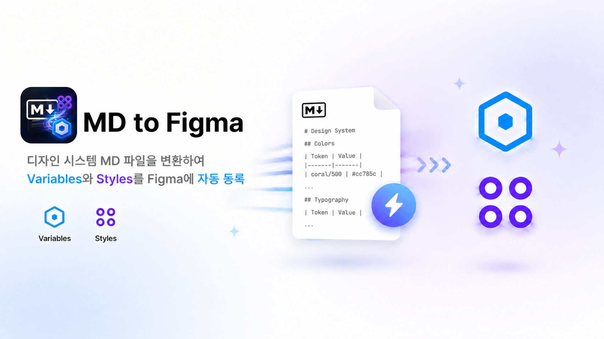
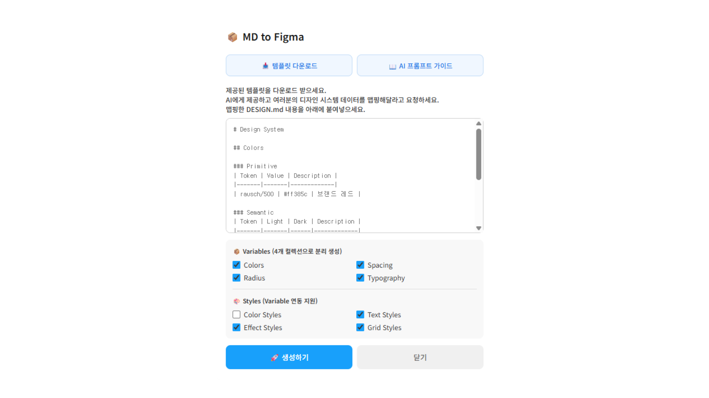
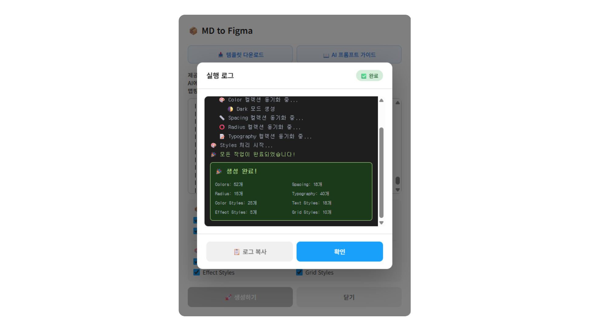
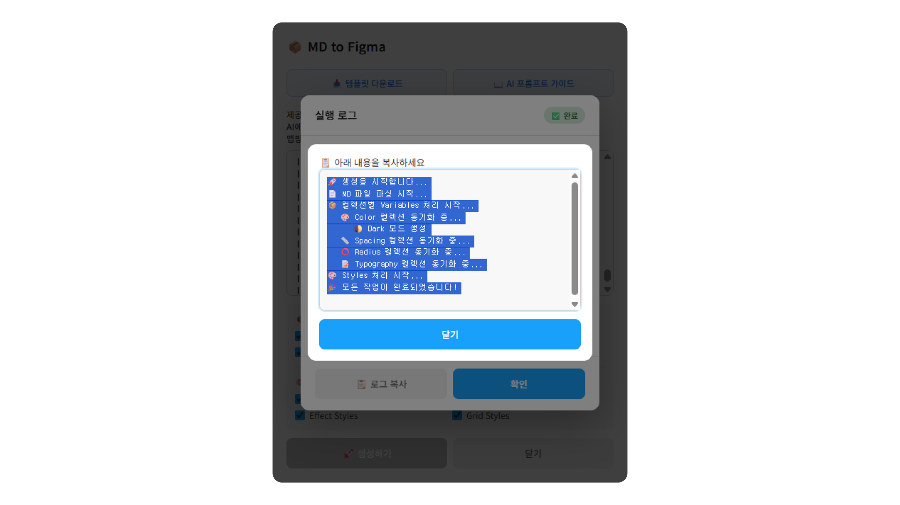
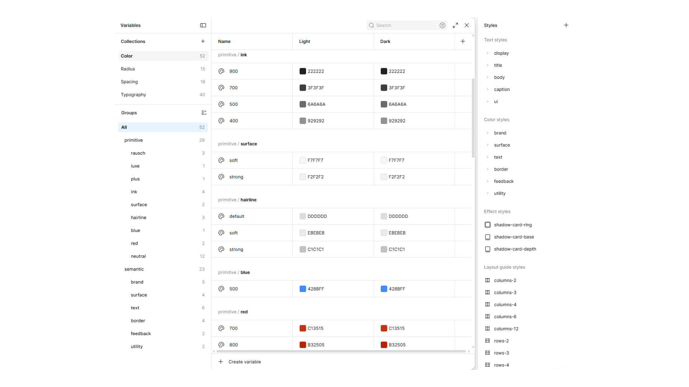

# 📦 MD to Figma

**Paste the template-generated DESIGN.md — and get Variables, Styles, and bindings all at once!!**

Figma plugin that reads a structured Markdown file and generates your entire token system automatically.
4 separate Variable collections, Styles bound to those Variables, and natural numeric sorting — from a single paste.

[](https://www.figma.com/community/plugin/YOUR_PLUGIN_ID)




---

## 💡 MD to Figma를 쓰는 이유

Claude 등 AI를 Figma MCP와 연결해 디자인 시스템을 구축하다 보면, Variables와 Styles를 MCP를 통해 직접 등록할 때 토큰 소모가 상당하다는 걸 느끼게 됩니다.

AI가 DESIGN.md를 만들어냈다면, 그 이후 Figma 등록은 MD to Figma로 무료로 처리하세요. 추가 API 호출도, 토큰 낭비도 없습니다.

```
AI + Figma MCP  →  DESIGN.md  →  MD to Figma  →  Figma Variables & Styles
                                  (무료, 즉시)
```

---

## ✨ What Gets Generated

### Variables — 4 Collections

| Collection | Contents |
|---|---|
| **Colors** | Primitive palette + Semantic aliases (Light & Dark mode). Semantic tokens are strictly alias-bound. |
| **Spacing** | Primitive scale + Semantic aliases |
| **Radius** | Primitive scale + Semantic aliases |
| **Typography** | fontSize / lineHeight / letterSpacing, grouped by section (Display, Body, Caption, etc.) |

### Styles — all bound to Variables

| Style | Binding |
|---|---|
| Color Styles | → Semantic Color Variables |
| Text Styles | → Typography Variables (fontSize / lineHeight / letterSpacing) |
| Effect Styles | → Spacing Variables (drop shadow blur) |
| Grid Styles | → Spacing Variables (gutter / margin) |

### Other Features

- **Selective Generation** — Checkbox per collection and style type. Update only what you need.
- **Partial Sync** — Already have Variables? Generate Styles only and auto-link to existing ones.
- **Natural Numeric Sorting** — `space-4`, `space-8`, `space-16` sorted by value, not alphabetically.
- **Font Fallback** — Auto fallback chain: requested style → Regular → Inter → Inter Regular.
- **Live Execution Log** — Real-time log panel with copy support.

---

## 📸 Screenshots

| UI | Result |
|---|---|
|  |  |
| Initial screen — paste DESIGN.md and select options | Generation complete with variable & style counts |

| Log Modal | Figma Output |
|---|---|
|  |  |
| Execution log — copy and paste directly into AI for debugging | Variables & Styles registered in Figma |

---

## 🚀 How It Works

1. **Collect** your design system data — from a Figma file, brand guidelines, website, or any source
2. **Download** the DESIGN.md template from the plugin (or from [`resources/`](./resources/))
3. **Hand both to any AI** (Claude, ChatGPT, etc.) — the AI uses the template as a pattern reference to organize your data, infer missing values, and output a complete, structured DESIGN.md
4. **Paste** the AI-generated DESIGN.md into the plugin
5. **Select** which Variables and Styles to generate
6. **Click Generate** — done

---

## 📖 Resources

| File | Description |
|---|---|
| [DESIGN-TEMPLATE.md](./resources/DESIGN-TEMPLATE.md) | Token template with formatting rules and examples |
| [AI-PROMPT-GUIDE.md](./resources/AI-PROMPT-GUIDE.md) | Ready-to-use prompts for filling the template with AI |
| [TEMPLATED-SAMPLE.md](./resources/TEMPLATED-SAMPLE.md) | Sample DESIGN.md generated from the template (Airbnb-inspired) |

> Raw links for in-plugin download:
> - `https://raw.githubusercontent.com/YOUR_USERNAME/md-to-figma/main/resources/DESIGN-TEMPLATE.md`
> - `https://raw.githubusercontent.com/YOUR_USERNAME/md-to-figma/main/resources/AI-PROMPT-GUIDE.md`

---

## 🗂 Repository Structure

```
md-to-figma/
├── code.js                      # Plugin main logic
├── ui.html                      # Plugin UI
├── manifest.example.json        # Manifest template (rename and fill in your plugin ID)
├── .gitignore                   # manifest.json excluded
├── README.md
└── resources/
    ├── DESIGN-TEMPLATE.md       # DESIGN.md template
    ├── AI-PROMPT-GUIDE.md       # AI prompt guide
    ├── TEMPLATED-SAMPLE.md      # Sample output generated from the template
    ├── cover_v2.png             # Plugin cover image
    ├── Icon_v2.png              # Plugin icon
    ├── Frame2.png               # Screenshot: initial UI
    ├── Frame3.png               # Screenshot: generation complete
    ├── Frame4.png               # Screenshot: log modal
    └── Frame5.png               # Screenshot: Figma output
```

> `manifest.json` is excluded from version control to protect the plugin ID.

---

## 🛠 Development

### Local Setup

1. Clone the repository
```bash
git clone https://github.com/YOUR_USERNAME/md-to-figma.git
```

2. Copy and configure the manifest
```bash
cp manifest.example.json manifest.json
```
Then replace `YOUR_PLUGIN_ID` in `manifest.json` with your actual Figma plugin ID.

3. Open Figma Desktop → Plugins → Development → Import plugin from manifest
4. Select `manifest.json`

### Publishing

1. Edit `code.js` or `ui.html`
2. Test in Figma Desktop
3. Plugins & Widgets → MD to Figma → ··· → **Publish new version**
4. Write release notes and submit

> `manifest.json`의 `"api"` 필드는 Figma API 버전이므로 수정하지 않습니다.
> 플러그인 버전은 `code.js` 상단 주석으로 관리합니다.

---

## v2.2.1 릴리즈 노트 (Latest)

### 🚀 대규모 업데이트: Bidirectional Stable Engine
이번 업데이트는 플러그인의 아키텍처를 전면 재구축하여 **완전한 양방향 디자인 시스템 관리**를 지원합니다.

#### **1. 양방향 엔진 (Figma ⇄ Markdown)**
- **추출(Export) 기능 추가**: 이제 피그마에 등록된 변수와 스타일을 단 한 번의 클릭으로 완벽한 마크다운 문서로 추출할 수 있습니다.
- **무결성 복구**: 참조가 끊긴 변수는 `recovered/` 토큰으로 자동 생성하여 디자인 시스템의 연속성을 보장합니다.

#### **2. 스마트 타이포그래피 시스템**
- **LineHeight 지능형 바인딩**: 단위(`px`, `%`, `배수`)를 스스로 분석하여, 피그마 UI가 깨지지 않도록 바인딩 여부를 지능적으로 결정합니다.
- **Inter 자동 폴백 배리어블**: 에어비앤비 폰트 등이 없는 환경에서도 플러그인이 `Inter` 변수를 자동 생성하고 스타일과 연결하여 취소선(Missing Font) 없는 깨끗한 시스템을 구축합니다.

#### **3. 전문가용 QA 리포팅 모달**
- **에러 & QA 탭 분리**: 단순 로그를 넘어, 시스템 개선 사항을 제안하는 QA 탭이 추가되었습니다.
- **AI 브리핑 복사**: 리포트 내용을 AI(ChatGPT, Claude)에게 즉시 전달할 수 있는 전용 프롬프트 복사 버튼을 제공합니다.

#### **4. 성능 및 안정성 강화**
- **Map 캐싱 엔진**: 대규모 데이터 처리 시 중복 생성을 100% 방지하고 기존 데이터를 정확히 덮어쓰도록(Overwrite) 최적화되었습니다.
- **인코딩 안정화**: 특수 문자 및 이모지로 인한 플러그인 로딩 실패 문제를 해결했습니다.


---

## v1.6.0 릴리즈 노트 (Old)

### ✨ 새로운 기능 및 개선
#### **Typography 변수 바인딩 완벽 지원 (Font Family & Weight)**
- 텍스트 스타일 생성 시 폰트 속성이 변수에 정상적으로 바인딩되도록 개선되었습니다.
- **스마트 Font Weight 매핑**: 마크다운 템플릿에 `600`, `semibold`, `midium`(오타) 등 다양한 형태로 두께를 입력하더라도, Figma 표준 명칭으로 자동 변환합니다.


---

## 📄 License

MIT